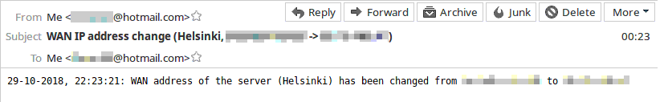
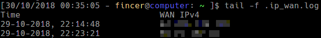

# WAN IP checker

WAN IPv4 checker & email notifier for computer environments behind dynamic IP address.

## About

In many home networks, WAN (Wide Area Network) IP addresses are dynamically allocated by a local ISP. Usually this is acceptable in common household/home use, but not in server use where static DHCP lease/static IP address is very much a mandatory requirement.

If configuring a static WAN IP is not an option to you, consider setting up a simple notifier which let's you know when your WAN IP address changes.

Static IPs are usually offered only to corporate environments, and not everyone wants to pay extra for such in order to establish a simple server environment in home.

This repository contains a Systemd service & a simple bash script to refresh current WAN IPv4 of a Linux computer, and notify administration for any changes in the WAN IPv4 (Internet) address. This method addresses to several issues:

- Administration is always aware of the current server IPv4 address, whether the address is dynamic or not.

- Administration is able to remotely connect to the server environment although the server IP has been changed. This is possible because admins are notified about any WAN IPv4 address changes via email by the server itself, automatically.

## Failure countermeasures

The WAN IP checker script has several countermeasures for the following failures:

- **DNS name resolution fails**: DNS servers defined in `/etc/resolv.conf` can not be contacted

  - Fall back to DNS servers listed in [wanchecker.sh](ssmtp_conf-sample/wanchecker.sh)

- **Sending email fails**

  - Attempt several times until informing that sending an email message has failed

------------

## Requirements

- Linux OS

    - systemd

    - [sSMTP](https://wiki.archlinux.org/index.php/SSMTP) - (SMTP) email client (package: `ssmtp` (Arch Linux), `ssmtp` (Ubuntu))

    - curl

    - bash

    - awk

    - cat

    - grep

    - sed

    - wc

    - **Optionally:** [resolvconf-override (GitHub/hadess)](https://github.com/hadess/resolvconf-override)

## Contents

- systemd **system** service file: [wanchecker.service](wanchecker.service)

    - Service is run as user `mail` and group `mail`. Change these if necessary.

- systemd **system** timer file: [wanchecker.timer](wanchecker.timer)

- WAN IP check interval is customizable in systemd timer file. Default value is `15min`

- [sSMTP sample configuration files](ssmtp_conf-sample)

    - [ssmtp.conf](ssmtp_conf-sample/ssmtp.conf)

    - [revaliases](ssmtp_conf-sample/revaliases)

    - [wanchecker.sh](ssmtp_conf-sample/wanchecker.sh)

    - [wanchecker.conf](ssmtp_conf-sample/wanchecker.conf)

        - Default log file location `/var/spool/mail/ip_wan.log` is defined in this file. The log file is updated only when WAN IPv4 changes have been detected.

## Manual installation & configuration

**1)** Install `ssmtp` package

**2)** Deploy provided files as follows:

|        Repository location        |          Filesystem location           |
|-----------------------------------|----------------------------------------|
| ssmtp_conf-sample/wanchecker.sh   | /etc/ssmtp/wanchecker.sh               |
| ssmtp_conf-sample/wanchecker.conf | /etc/ssmtp/wanchecker.conf             |
| wanchecker.service                | /etc/systemd/system/wanchecker.service |
| wanchecker.timer                  | /etc/systemd/system/wanchecker.service |

|                  File                  | Owner (u.g) | Permission bits |
|----------------------------------------|-------------|-----------------|
| /etc/ssmtp/wanchecker.sh               |  root.mail  |            0750 |
| /etc/ssmtp/wanchecker.conf             |  root.mail  |            0640 |
| /etc/systemd/system/wanchecker.service |  root.root  |            0644 |
| /etc/systemd/system/wanchecker.service |  root.root  |            0644 |

**3)** Configure `sSMTP` files `/etc/ssmtp/revaliases` ([sample](ssmtp_conf-sample/revaliases)), `/etc/ssmtp/ssmtp.conf` ([sample](ssmtp_conf-sample/ssmtp.conf)). More information about these files on [sSMTP Arch Wiki site](https://wiki.archlinux.org/index.php/SSMTP).

**4)** Configure file `/etc/ssmtp/wanchecker.conf` ([sample](ssmtp_conf-sample/wanchecker.conf))

**5)** If necessary, configure sSMTP as described in [sSMTP Readme file](ssmtp_conf-sample/README.md).

**6)** Run (as root or with `sudo`):

```
systemctl enable wanchecker.timer && \
systemctl start wanchecker.timer

```

**7) (optional)** Install [resolvconf-override](https://github.com/hadess/resolvconf-override)

## Arch Linux installation & configuration

**1)** Use provided [PKGBUILD](arch_linux/PKGBUILD) file

**2)** Configure files `/etc/ssmtp/revaliases` ([sample](ssmtp_conf-sample/revaliases)) and `/etc/ssmtp/ssmtp.conf` ([sample](ssmtp_conf-sample/ssmtp.conf)). More information about these files on [sSMTP Arch Wiki site](https://wiki.archlinux.org/index.php/SSMTP).

**3)** Configure file `/etc/ssmtp/wanchecker.conf` ([sample](ssmtp_conf-sample/wanchecker.conf))

**4)** Run (as root or with `sudo`):

```
systemctl enable wanchecker.timer && \
systemctl start wanchecker.timer

```

**5) (optional)** Install [resolvconf-override](https://github.com/hadess/resolvconf-override). Use provided Arch Linux [PKGBUILD file](arch_linux/resolvconf-override/PKGBUILD).

----------

## Images

When server computer discovers a change in its WAN IPv4, it automatically sends an email notification to system administrator(s):



Additionally, server computer keeps a log file which include WAN IPv4 changes and corresponding timestamps:



## Useful commands

- `systemctl --all list-timers` = list all system timers on Linux system, including `wanchecker` timer

- `systemctl is-active wanchecker.timer` = tells whether `wanchecker` timer is running or not

- `systemctl status wanchecker.timer` = more compherensive output about the status of `wanchecker` timer

## License

This repository uses GPLv3 license. See [LICENSE](./LICENSE) file for details.
